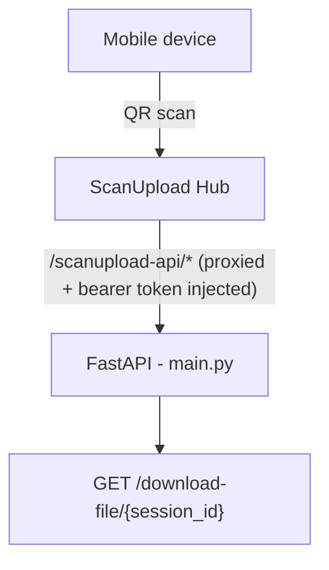

# Introduction

[ScanUpload](https://app.scanupload.net/) enables the integration and the
ability to use QR codes to scan and upload files directly from a mobile device
to your webapp.

# Quickstart

1. Please generate a client id and secret at
   [ScanUpload](https://app.scanupload.net/) and save the details.

## Docker

You need to have
[Docker Desktop](https://www.docker.com/products/docker-desktop/) and git
installed on your machine.

Open a command line, powershell or bash session and clone the git repo into

```sh
git clone https://github.com/donaldasante/scanupload.example.python-and-js.git
```

Goto the repo folder (`cd .\scanupload.example.python-and-js`) and rename the
.env.example to .env. Replace the placeholders with your client id, secret and
save the file.

```sh
KEYCLOAK_CLIENT_ID=your-client-id
KEYCLOAK_CLIENT_SECRET=your-client-secret
```

Run docker compose

```sh
docker compose build
docker compose up -d
```

Navigate to http://localhost:3002.

---

# ScanUpload Python Example

A FastAPI application that integrates the
[scan-upload-api-client](https://pypi.org/project/scan-upload-api-client/)
Python package to enable QR-code-based file uploads from a mobile device to your
web app.

## How it works



- **`ScanUploadProxyMiddleware`** intercepts every `/scanupload-api/*` request,
  obtains a Keycloak bearer token, and forwards the request to the ScanUpload
  hub.
- **`GET /download-file/{session_id}`** downloads all files uploaded in a
  session and returns them as a single `.zip` archive.

---

## Prerequisites

- [Python 3.11+](https://www.python.org/downloads/)
- A [ScanUpload account](https://app.scanupload.net/) with a **Client ID** and
  **Client Secret**

---

## Project structure

```
ScanUpload.Example.Python/
├── app/
│   └── main.py          # FastAPI application
├── .env.example         # Environment variable template
├── requirements.txt     # Python dependencies
└── README.md
```

---

## 1. Install Python dependencies

**PowerShell**

```powershell
cd path\to\ScanUpload.Example.Python
pip install -r requirements.txt
```

**Bash**

```bash
cd path/to/ScanUpload.Example.Python
pip install -r requirements.txt
```

This installs:

- `scan-upload-api-client[asgi]` — the ScanUpload client with FastAPI/uvicorn
  extras
- `python-dotenv` — `.env` file loading

---

## 2. Configure environment variables

Copy the example file and fill in your credentials:

**PowerShell**

```powershell
Copy-Item .env.example .env
```

**Bash**

```bash
cp .env.example .env
```

Open `.env` and set the two required values:

```ini
KEYCLOAK_CLIENT_ID=your-client-id
KEYCLOAK_CLIENT_SECRET=your-client-secret
```

All available settings:

| Variable                         | Default                                    | Description                        |
| -------------------------------- | ------------------------------------------ | ---------------------------------- |
| `KEYCLOAK_CLIENT_ID`             | _(required)_                               | Your ScanUpload client ID          |
| `KEYCLOAK_CLIENT_SECRET`         | _(required)_                               | Your ScanUpload client secret      |
| `KEYCLOAK_SERVER_URL`            | `https://identity.scanupload.net/`         | Keycloak server URL                |
| `KEYCLOAK_REALM`                 | `scanupload-hub`                           | Keycloak realm                     |
| `KEYCLOAK_SCOPE`                 | `openid profile email scanupload.hub`      | Token scopes                       |
| `SCANUPLOAD_TARGET_BASE_URL`     | `https://hub.scanupload.net/api/front-end` | ScanUpload hub proxy target        |
| `SCANUPLOAD_ROUTE_PREFIX`        | `/scanupload-api`                          | Route prefix exposed by this app   |
| `SCANUPLOAD_TOKEN_ROUTE`         | `/scanupload-api/token`                    | Token endpoint route               |
| `SCANUPLOAD_STRIP_ROUTE_PREFIX`  | `true`                                     | Strip prefix before forwarding     |
| `SCANUPLOAD_REQUEST_TIMEOUT`     | `90`                                       | Proxy request timeout (seconds)    |
| `SCANUPLOAD_API_CLIENT_BASE_URL` | `https://hub.scanupload.net`               | Base URL for file downloads        |
| `HOST`                           | `127.0.0.1`                                | Address the Python server binds to |
| `PORT`                           | `8080`                                     | Port the Python server listens on  |
| `SCANUPLOAD_DOTENV_PATH`         | _(optional)_                               | Override `.env` file path          |

> **Warning:** Never commit `.env` to source control. It contains secrets.

---

## 3. Run the backend

**PowerShell**

```powershell
cd path\to\ScanUpload.Example.Python
python app/main.py
```

**Bash**

```bash
cd path/to/ScanUpload.Example.Python
python app/main.py
```

Expected output:

```
INFO:scanupload.example:Starting ScanUpload Python example on http://127.0.0.1:8080
INFO:     Started server process [...]
INFO:     Uvicorn running on http://127.0.0.1:8080 (Press CTRL+C to quit)
```

> The server binds to `127.0.0.1` (localhost) by default. To expose it on all
> network interfaces (for example inside a container), set `HOST=0.0.0.0`.

Alternatively, use uvicorn directly (useful for `--reload` during development):

**PowerShell**

```powershell
cd app
uvicorn main:app --port 8080 --reload
```

**Bash**

```bash
cd app
uvicorn main:app --port 8080 --reload
```

Verify the backend is running:

**PowerShell**

```powershell
Invoke-RestMethod http://localhost:8080/
# {"message":"ScanUpload API client is active"}
```

**Bash**

```bash
curl http://localhost:8080/
# {"message":"ScanUpload API client is active"}
```

---

## 4. API endpoints

| Method | Path                          | Description                            |
| ------ | ----------------------------- | -------------------------------------- |
| `GET`  | `/`                           | Health check                           |
| `ANY`  | `/scanupload-api/*`           | Proxied to ScanUpload hub (middleware) |
| `GET`  | `/download-file/{session_id}` | Download uploaded files as a `.zip`    |

### Interactive API docs

While the server is running, visit:

- Swagger UI: [http://localhost:8080/docs](http://localhost:8080/docs)
- ReDoc: [http://localhost:8080/redoc](http://localhost:8080/redoc)

---

## Troubleshooting

### Port already in use

```
[Errno 10048] error while attempting to bind on address ('127.0.0.1', 8080)
```

Find and stop the process occupying the port:

**PowerShell**

```powershell
# Find the PID
netstat -ano | findstr :8080

# Stop it (replace 12345 with the actual PID)
Stop-Process -Id 12345 -Force
```

**Bash**

```bash
# Find the PID
lsof -i :8080

# Stop it (replace 12345 with the actual PID)
kill 12345
```

### Missing environment variable

```
RuntimeError: Required environment variable 'KEYCLOAK_CLIENT_ID' is not set.
```

Ensure `.env` exists in the project root and contains `KEYCLOAK_CLIENT_ID` and
`KEYCLOAK_CLIENT_SECRET`.

### Token provider not found

```
ScanUploadProxyException: Token provider not found on app.state.scan_upload_token_provider
```

The middleware requires the token provider to be stored on
`app.state.scan_upload_token_provider`. Verify this is set in `lifespan()`
inside `main.py`.
